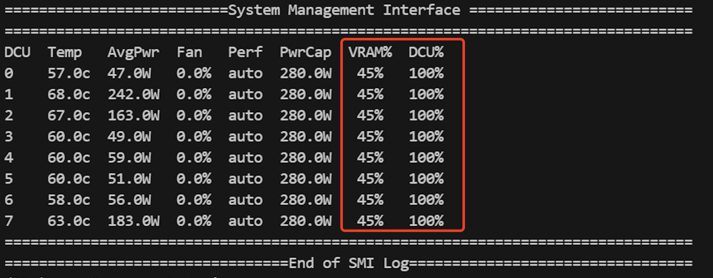

# llmAction

##### 项目相关内容

- 大模型（chatglm）api+web启动
  
- 大模型微调（lora、ptunning）
- 主要针对ChatGLM3-6B模型进行不同方式的微调（Freeze方法、Lora方法、P-Tuning方法、全量参数等），并对比大模型在不同微调方法上的效果，主要针对信息抽取任务、生成任务、分类任务等。
- 
- RAG技术（长文档检索、文档分类）
  
- learning_about
  - ChatGPT的API调用
  - GPT4的计费计算
  - LangChain使用方法
  - Faiss使用方法
  - Pytorch框架学习
  - Sentence Transformer
  - 根据Embedding方法计算文本相似性
